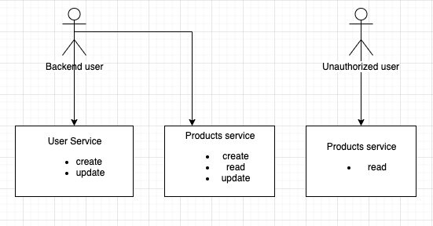

Simple eCommerce System
=======================

### Project description
This project contains an implementation of simple shop system with basic functionality like products catalog / search / cart and order mechanism. 
Current version supports only small bunch of CRUD methods for user and product entities. (for further information see api documentation bellow)

### API Documentation
Swagger file: [api-documentation](documentation/swagger.yaml).\
You can use http://editor.swagger.io/ to view the content of this file.

### Logical architecture
Currently two services are available. 

1. User Service is responsible for creating backend users.\
Backend users are able to execute CRUD operations on all shop relevant entities. They can also create new admin users.

2. The second service is a product service, administrators can consume this service to create, update and delete of products.\
Unauthorized users can only read catalog products.  

Here is some simple visual representation:\

### Physical architecture
* Webservices are running on nginx web server.
* All backend services are currently build with PHP Framework Lumen (https://lumen.laravel.com/)
* MySql is used as Database service.

### Installation
Dependencies:
 * docker
 * docker-compose
 * make
 
Clone project repo to your local environment first. Switch to the cloned folder and execute\
``make`` to compose up the docker infrastructure and install all dependencies. Also database magrations will be executed automatically.

After installation you can open following URL's in your browser:  
* http://localhost - catalog list should be shown
* http://localhost/admin - simple admin section with possibility to create new admin user and new products
> Login credentials for admin section:\
 `Email: max@gmail.com`\
 `Password: password`

> Tested on macOS Mojave 10.14.x